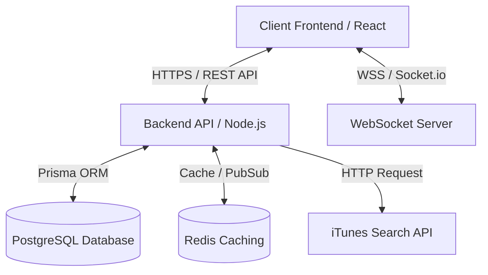
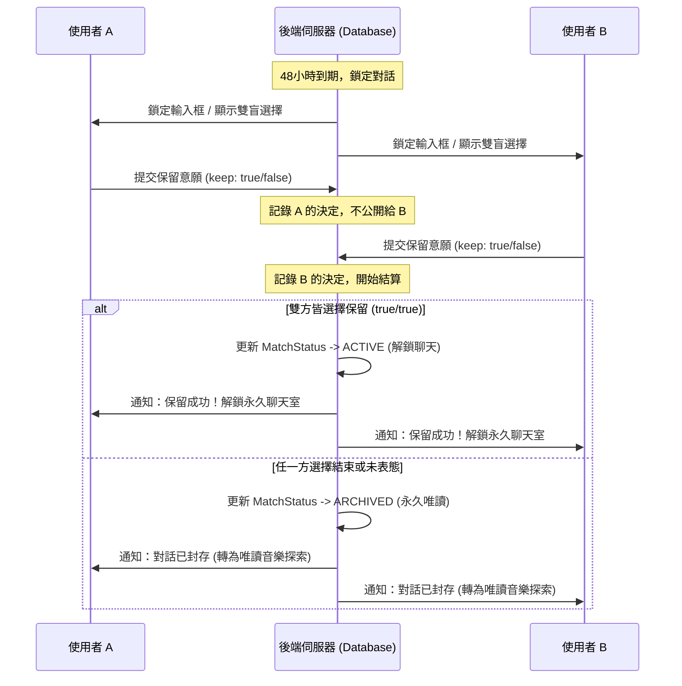

# 技術規格書 (Technical Specification)：Ditto 音樂卡片與限時品味交流社交 APP

本文件詳細規範 **Ditto** 音樂交友應用程式的技術實現細節、架構設計、資料庫結構、核心演算法以及通訊協定，作為後續專案開發的唯一技術基準。

---

## 目錄 (Table of Contents)
1. [系統架構概覽 (System Architecture)](#一-系統架構概覽-system-architecture)
2. [資料庫 Schema 設計 (Database Schema)](#二-資料庫-schema-設計-database-schema)
3. [核心功能技術實現 (Core Implementations)](#三-核心功能技術實現-core-implementations)
   - [A. 歌曲搜尋與固定 30 秒播放控制](#a-歌曲搜尋與固定-30-秒播放控制)
   - [B. 品味配對演算 (Vibe Matcher)](#b-品味配對演算-vibe-matcher)
   - [C. 48 小時限時聊天室 (WebSocket)](#c-48-小時限時聊天室-websocket)
   - [D. 雙盲結算與狀態轉換機制](#d-雙盲結算與狀態轉換機制)
   - [E. 聊天室共聽與同步播放 (Co-listening)](#e-聊天室共聽與同步播放-co-listening)
4. [API 與 WebSocket 介面定義 (API Specification)](#四-api-與-websocket-介面定義-api-specification)

---

## 一、 系統架構概覽 (System Architecture)

本專案採用前後端分離架構，前端採用 Mobile-first 的響應式設計，後端提供即時通訊與運算服務。



### 1. 前端 (Frontend)
- **核心框架**：Next.js (App Router) 或 React (Vite)。
- **樣式管理**：Vanilla CSS 與 CSS Modules。為求介面高質感與流暢度，需包含平滑的卡片滑動微動畫。
- **即時通訊**：Socket.io-client。
- **音訊管理**：HTML5 Audio API，控制固定 30 秒的試聽播放。

### 2. 後端 (Backend)
- **核心框架**：Node.js (NestJS 或 Express)。
- **即時通訊**：Socket.io。
- **ORM 工具**：Prisma。
- **定時任務**：Node-cron (用於定期處理過期聊天室)。

### 3. 資料庫與快取 (Database & Cache)
- **主要資料庫**：PostgreSQL，儲存用戶、配對關係、聊天訊息等結構化資料。
- **快取/即時狀態**：Redis（可選，用於 WebSocket 線上狀態快取與即時連線同步）。

### 4. 外部音樂服務
- **iTunes Search API**：免認證、無流量限制（合理範圍內），提供穩定的歌曲元數據（Metadata）及 30 秒音訊預聽 URL。

---

## 二、 資料庫 Schema 設計 (Database Schema)

本專案採用 PostgreSQL，使用 Prisma ORM 進行資料定義。以下是完整的 `schema.prisma` 定義：

```prisma
// 數據源配置
datasource db {
  provider = "postgresql"
  url      = env("DATABASE_URL")
}

generator client {
  provider = "prisma-client-js"
}

// ----------------------------------------
// 1. 用戶帳號與基本資料
// ----------------------------------------
model User {
  id           String        @id @default(uuid())
  email        String        @unique
  name         String
  avatar       String?       // 頭像 URL
  genres       String[]      // 註冊時勾選的愛好曲風標籤 (例如: ["Indie", "Pop", "Jazz"])
  artists      String[]      // 註冊時填寫的愛好歌手/樂團 (例如: ["Deca Joins", "伍佰"])
  createdAt    DateTime      @default(now())
  updatedAt    DateTime      @updatedAt

  cards        MusicCard[]   // 用戶建立的音樂卡片歷史
  matches      MatchMember[] // 用戶參與的配對
  messages     Message[]     // 用戶發送的訊息
}

// ----------------------------------------
// 2. 音樂卡片 (每日 5 首代表歌曲)
// ----------------------------------------
model MusicCard {
  id           String        @id @default(uuid())
  userId       String
  user         User          @relation(fields: [userId], references: [id], onDelete: Cascade)
  cardName     String        // 卡片命名 (例如: "午夜微醺 Vibe")
  
  // 儲存 5 首歌曲的 JSON 結構，格式規範如下:
  // [
  //   {
  //     "trackId": "1440843825",
  //     "trackName": "浴室",
  //     "artistName": "Deca Joins",
  //     "previewUrl": "https://audio-ssl.itunes.apple.com/...",
  //     "coverUrl": "https://is5-ssl.mzstatic.com/..."
  //   }, ...
  // ]
  songs        Json          
  
  isCurrent    Boolean       @default(false) // 是否為當前生效的配對卡片 (每個用戶同一時間只能有一張為 true)
  createdAt    DateTime      @default(now())
  updatedAt    DateTime      @updatedAt

  @@index([userId])
}

// ----------------------------------------
// 3. 配對與聊天室
// ----------------------------------------
model Match {
  id           String          @id @default(uuid())
  status       MatchStatus     @default(PENDING) // 配對狀態
  expiresAt    DateTime        // 48 小時到期時間戳記
  createdAt    DateTime        @default(now())
  updatedAt    DateTime        @updatedAt

  members      MatchMember[]   // 配對成員 (固定為 2 人)
  messages     Message[]       // 聊天訊息
  decisions    MatchDecision[] // 48小時到期時的雙盲選擇結果
}

// 配對成員中間表
model MatchMember {
  id        String   @id @default(uuid())
  matchId   String
  match     Match    @relation(fields: [matchId], references: [id], onDelete: Cascade)
  userId    String
  user      User     @relation(fields: [userId], references: [id], onDelete: Cascade)

  @@unique([matchId, userId])
}

enum MatchStatus {
  PENDING  // 48小時對話倒數中
  ACTIVE   // 雙方皆保留，解鎖為永久好友
  ARCHIVED // 任一方結束或逾時，對話轉唯讀
}

// ----------------------------------------
// 4. 48小時到期雙盲選擇
// ----------------------------------------
model MatchDecision {
  id        String   @id @default(uuid())
  matchId   String
  match     Match    @relation(fields: [matchId], references: [id], onDelete: Cascade)
  userId    String   // 做決定的用戶 ID
  keep      Boolean  // 是否選擇保留關係 (true: 保留, false: 結束)
  createdAt DateTime @default(now())

  @@unique([matchId, userId])
}

// ----------------------------------------
// 5. 聊天訊息
// ----------------------------------------
model Message {
  id        String   @id @default(uuid())
  matchId   String
  match     Match    @relation(fields: [matchId], references: [id], onDelete: Cascade)
  senderId  String
  sender    User     @relation(fields: [senderId], references: [id], onDelete: Cascade)
  content   String   // 訊息內容
  createdAt DateTime @default(now())

  @@index([matchId])
}
```

---

## 三、 核心功能技術實現 (Core Implementations)

### A. 歌曲搜尋與固定 30 秒播放控制

#### 1. iTunes Search API 串接
當使用者在 App 內搜尋歌曲時，前端發送請求至後端，後端代理請求 iTunes API 以防跨網域（CORS）限制或方便快取：
* **請求網址**：`https://itunes.apple.com/search`
* **參數說明**：
  - `term`: 使用者輸入的搜尋關鍵字（歌名或歌手）。
  - `media`: 固定為 `music`。
  - `limit`: 限制回傳筆數（建議為 15~20 筆）。
* **後端過濾與封裝**：後端篩選出包含 `previewUrl`（試聽音訊檔網址，通常為 30 秒的 AAC 格式 M4A 檔案）與 `artworkUrl100`（專輯封面 100x100，可將網址中 `/100x100bb.jpg` 替換為 `/500x500bb.jpg` 以取得高畫質封面）的資料，並回傳給前端。

#### 2. HTML5 Audio 播放控制
由於取消了「自訂區間」，音訊播放統一由**首 30 秒**限制。
* **實現方式**：
  1. 使用單一全域的 `const audio = new Audio()` 實例，避免多重音軌重疊播放。
  2. 前端介面載入 `previewUrl`。
  3. 不需要手動監聽 `timeupdate` 來截斷，因為 iTunes 所提供的 `previewUrl` 本身就已經是**固定長度為 29~30 秒的預聽片段**。
  4. 當音訊播放結束時，監聽 `audio.onended` 事件，重置前端播放按鈕的狀態（UI 狀態變更為暫停/停止）。
  5. 實作**佇列播放 (Queue Play)**：當使用者點選某張卡片時，系統依序將 5 首歌曲載入播放佇列。當第一首歌曲結束時，自動切換至下一首的 `previewUrl` 並播放，直到 5 首播放完畢。

---

### B. 品味配對演算 (Vibe Matcher)

為了在不連動串流平台的情況下進行配對，演算法依據使用者註冊時填寫的**「音樂喜好標籤」**與**「當日 5 首歌曲的標籤交集」**來計算匹配分數（Vibe Score）。

#### 1. 相似度評分公式
設使用者 A 的音樂喜好曲風集合為 $G_A$，歌手集合為 $R_A$，當日卡片歌曲集合為 $S_A$。
使用者 B 亦同。

匹配分數 $Score(A, B)$ 範圍為 $0 \sim 1.0$，計算權重如下：
1. **曲風重合度（權重 50%）**：採用 Jaccard 相似係數。
   $$Score_{genre} = \frac{|G_A \cap G_B|}{|G_A \cup G_B|}$$
2. **歌手重合度（權重 30%）**：若有相同喜愛歌手，計算交集比例。
   $$Score_{artist} = \min\left(1.0, \frac{|R_A \cap R_B|}{3}\right)$$ *(交集達 3 個以上即得滿分)*
3. **當日歌曲重合度（權重 20%）**：比對兩人在當日挑選的 5 首代表歌曲。
   $$Score_{song} = \frac{|S_A \cap S_B|}{5}$$

最終評分公式：
$$Score_{total} = (Score_{genre} \times 0.5) + (Score_{artist} \times 0.3) + (Score_{song} \times 0.2)$$

#### 2. 配對推薦流程
當使用者 A 請求配對推薦名單時，後端執行以下流程：
1. **模式判定**：
   - **相似曲風**：篩選與 A 有至少一個相同曲風（$|G_A \cap G_B| \ge 1$）且當日已配置 5 首歌曲的用戶。
   - **隨機探索**：從當日已配置卡片的活躍用戶池中隨機挑選。
2. **計算與排序**：對篩選出來的候選用戶計算 $Score_{total}$，由高至低排序。
3. **排除已操作對象**：利用資料庫查詢，排除 A 已經「左滑跳過」或「右滑喜歡」的用戶。
4. **輸出結果**：回傳前 5 位候選用戶的資料（包含其音樂卡片中的 5 首歌曲列表），供前端進行卡片渲染。

---

### C. 48 小時限時聊天室 (WebSocket)

#### 1. WebSocket 房間建立 (Socket.io)
當用戶 A 對 用戶 B 投遞「喜歡」，且 B 先前也對 A 投遞了「喜歡」，系統判定配對成功（Match Success）：
1. 後端寫入資料庫 `Match` 紀錄，設定狀態為 `PENDING`，並計算 `expiresAt = NOW() + 48 小時`。
2. 透過 WebSocket 伺服器向 A 與 B 發送 `match_success` 事件，內含 `matchId`。
3. 前端接收後，引導使用者進入聊天介面，並呼叫 `socket.emit("join_room", { matchId })` 將兩者加入同一個 WebSocket 房間。

#### 2. 限時倒數機制
- **服務端計時基準**：以資料庫中 `expiresAt` 時間戳記為準。
- **前端顯示**：前端每秒計算 `Math.max(0, expiresAt - Date.now())`，格式化為 `HH:MM:SS` 顯示在頂部。**不可使用前端倒數器自行扣減**，每次初始化或重新連線時必須向伺服器拉取最新的時間戳記，防範用戶修改本機時區作弊。
- **後端定時清理 (Expired Match Cleanup)**：
  後端定時任務（如使用 `node-cron`，每 1 分鐘執行一次）掃描過期配對：
  ```sql
  -- 將所有已過期且狀態為 PENDING 的對話改為 ARCHIVED
  UPDATE "Match" 
  SET "status" = 'ARCHIVED', "updatedAt" = NOW() 
  WHERE "status" = 'PENDING' AND "expiresAt" <= NOW();
  ```
  完成後，伺服器向對應的 Room 發送 `room_expired` 事件，前端收到後立刻鎖定輸入框，並彈出雙盲表單。

---

### D. 雙盲結算與狀態轉換機制

當限時對話倒數歸零（`expiresAt` 到期）或排程更新狀態為 `ARCHIVED` 時，觸發雙盲結算流程。



#### 狀態轉換詳細邏輯
1. 用戶點選「保留」或「結束」，呼叫 `POST /api/matches/:matchId/decision` API。
2. 後端在 `MatchDecision` 資料表建立或更新一筆資料。
3. 伺服器檢查該 `matchId` 的決策數量：
   - **若僅有 1 方提交**：不對另一方透露決定，維持「等待對方決定」的 UI。
   - **若雙方皆已提交**：
     - 若 `A.keep == true` 且 `B.keep == true`：
       - 更新 `Match` 資料表的 `status` 為 `ACTIVE`。
       - 透過 WebSocket 發送 `match_unlocked` 事件，聊天室限制解除。
     - 若其中一方或雙方 `keep == false`：
       - 更新 `Match` 資料表的 `status` 為 `ARCHIVED`。
       - 透過 WebSocket 發送 `match_archived` 事件，聊天室進入永久唯讀狀態。
   - **逾時未提交**：若在過期後 24 小時內未完成選擇，系統定時任務自動判定為 `false`，並封存對話。

---

### E. 聊天室共聽與同步播放 (Co-listening)

當使用者在聊天室內想與對方一起聽歌時，不需跳轉第三方 App，而是利用 App 內建播放器與 WebSocket 信令來達到「毫秒級音軌對齊」的共聽體驗。

#### 1. 共聽信令控制流程
1. **發起邀請**：使用者 A 在聊天室點選對方卡片歌單中的某首歌曲，發送共聽請求：
   - 傳送 Socket 事件 `co_play:invite` 到房間，夾帶歌曲 ID 與資訊。
2. **接受邀請**：使用者 B 點選對話框中的「接受」：
   - B 的前端發送 Socket 事件 `co_play:accept` 給伺服器。
3. **廣播同步啟動**：後端接收到 `co_play:accept` 後，獲取**當前伺服器的高精準度時間戳記（`serverStartTime`）**，加上 2 秒的網路與緩衝預載時間，向 A 與 B 廣播 `co_play:start` 信令：
   ```json
   {
     "previewUrl": "https://audio-ssl.itunes.apple.com/...",
     "serverStartTime": 1716652400000 // 伺服器時間戳記 (毫秒)
   }
   ```
4. **前端延遲補償與對齊**：
   A 與 B 的前端收到 `co_play:start` 後，進行以下操作：
   - 載入音訊，但不立刻播放。
   - 透過心跳包或預先估算的網路延遲（RTT），計算出當下的本機時間與 `serverStartTime` 的差值：
     ```javascript
     const serverStartTime = data.serverStartTime;
     const now = Date.now(); // 本機當前時間
     const delay = now - serverStartTime; // 已過去的毫秒數

     if (delay < 0) {
       // 代表還沒到預定播放時間（2秒緩衝內），設定定時器在到達時間點時準時播放
       setTimeout(() => {
         audio.play();
       }, Math.abs(delay));
     } else if (delay < 30000) {
       // 如果已經超過預定播放時間，但還在 30 秒內，則將進度條移至對應位置播放
       audio.currentTime = delay / 1000;
       audio.play();
     } else {
       // 超過 30 秒代表播放已結束
       console.log("共聽已結束");
     }
     ```

---

## 四、 API 與 WebSocket 介面定義 (API Specification)

### 1. RESTful API 端點

#### 【用戶管理 & Onboarding】
* **`POST /api/users/register`**
  - **說明**：註冊並初始化用戶資料與喜好。
  - **Request Body**:
    ```json
    {
      "email": "user@example.com",
      "name": "Alex",
      "genres": ["Indie Rock", "City Pop"],
      "artists": ["Deca Joins", "落日飛車"]
    }
    ```
  - **Response (201)**: 用戶物件。

#### 【音樂卡片管理】
* **`GET /api/music/search`**
  - **說明**：搜尋 iTunes 歌曲庫。
  - **Query Parameters**: `term=歌名或歌手`
  - **Response (200)**:
    ```json
    [
      {
        "trackId": "1440843825",
        "trackName": "浴室",
        "artistName": "Deca Joins",
        "previewUrl": "https://audio-ssl.itunes.apple.com/...",
        "coverUrl": "https://is5-ssl.mzstatic.com/..."
      }
    ]
    ```
* **`POST /api/music-cards`**
  - **說明**：建立一組新的每日 5 首音樂卡片。
  - **Request Body**:
    ```json
    {
      "cardName": "週五午夜 Vibe",
      "songs": [
        { "trackId": "1", "trackName": "Song A", "artistName": "Art A", "previewUrl": "...", "coverUrl": "..." },
        { "trackId": "2", "trackName": "Song B", "artistName": "Art B", "previewUrl": "...", "coverUrl": "..." },
        { "trackId": "3", "trackName": "Song C", "artistName": "Art C", "previewUrl": "...", "coverUrl": "..." },
        { "trackId": "4", "trackName": "Song D", "artistName": "Art D", "previewUrl": "...", "coverUrl": "..." },
        { "trackId": "5", "trackName": "Song E", "artistName": "Art E", "previewUrl": "...", "coverUrl": "..." }
      ]
    }
    ```
  - **Response (201)**: 建立的卡片物件，且將此卡片自動設為 `isCurrent = true`。

#### 【配對與決策】
* **`GET /api/matches/recommendations`**
  - **說明**：獲取今日配對候選人。
  - **Query Parameters**: `mode=genre|random`
  - **Response (200)**: 5 位推薦候選人的列表，包含其個人資料與今日音樂卡片。
* **`POST /api/matches/:matchId/decision`**
  - **說明**：限時結束後，提交雙盲保留決定。
  - **Request Body**:
    ```json
    {
      "keep": true
    }
    ```
  - **Response (200)**: `{"status": "PENDING" | "ACTIVE" | "ARCHIVED"}`。

---

### 2. WebSocket 事件 (Socket.io)

| 事件名稱 | 傳送方向 | 資料格式 | 說明 |
| :--- | :--- | :--- | :--- |
| **`join_room`** | Client -> Server | `{ "matchId": "string" }` | 用戶進入聊天頁面時加入對應 Socket 房間。 |
| **`send_msg`** | Client -> Server | `{ "matchId": "string", "content": "string" }` | 用戶發送文字訊息。 |
| **`receive_msg`** | Server -> Client | `{ "id": "msg-id", "senderId": "string", "content": "string", "createdAt": "datetime" }` | 廣播新訊息給房間內的其他用戶。 |
| **`room_expired`** | Server -> Client | `{ "matchId": "string" }` | 48小時時間到，通知雙方鎖定輸入框並開啟雙盲選擇 UI。 |
| **`match_unlocked`**| Server -> Client | `{ "matchId": "string" }` | 雙方皆同意保留，通知房間解鎖為永久好友聊天室。 |
| **`match_archived`**| Server -> Client | `{ "matchId": "string" }` | 結算失敗，通知房間轉為唯讀歷史紀錄。 |
| **`co_play:invite`**| Client -> Server | `{ "matchId": "string", "song": Json }` | 發送同步共聽邀請。 |
| **`co_play:accept`**| Client -> Server | `{ "matchId": "string" }` | 接受共聽邀請。 |
| **`co_play:start`** | Server -> Client | `{ "previewUrl": "string", "serverStartTime": number }` | 伺服器廣播給雙方，指示前端開始同步載入並播放音訊。 |
